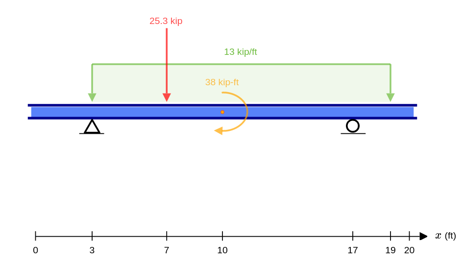
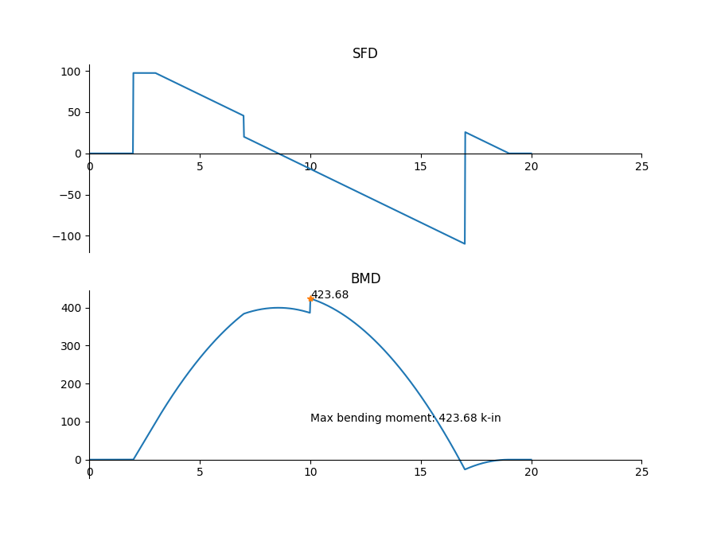

# beam-solver

### What is it?

This is a civil engineering tool that aims towards solving any statically determinate beam. which means it can solve the reactions and draw Shear Force Diagram (SFD) and Bending Moment Diagram (BMD). This tool is suitable for civil engineering students as well as civil engineering graduates who are taking preperation for job examinations. This project also consists of a package named [`beam_package`](./beam_package) which any one can easily use if someone wants to add additional features to this project or derive other software utilities out of it.

### Environment Setup and Sample Execution

  1. Install any version of *python 3* and make sure you have *pip*.
  2. Optional: You may setup a virtual environment, ie. from your terminal do: `virtualenv venv`.
  3. Clone this repository and cd to project.
  
  ```bash
  git clone https://github.com/s-shifat/beam-solver.git
  cd beam-solver
  ```
  4. Install dependencies.
  
  ```bash
  pip install -r requirements.txt
  ```
  5. Now you can define your beam in a json format following [this file](https://github.com/s-shifat/beam-solver/blob/main/json_structure.jpg).
  6. Once you've defined your beam, now just run:
  ```bash
  python3 main.py your_json_file.json
  ```
  ###### Note: there are some json examples in [test_data](./test_data) directory.
  
### Sample Usage
  1. Your beam: 
  2. Make a json representation of the beam. The instructions about making a beam json object are in [this](./doc/img/json_structure.jpg) file. The json representaton of the beam mentioned above would be:
  <br>`your_beam.json`:
  ```json
  {
    "length": 20,
    "supports":[
        {
            "type": "pin",
            "position": 2
        },
        {
            "type": "roller",
            "position": 17
        }
    ],
    "loads":[
        {
            "type": "p",
            "position": 7,
            "magnitude": 25.3,
            "direction": "down"
        },
        {
            "type": "m",
            "position": 10,
            "magnitude": 38,
            "direction": "cw"
        },
        {
            "type": "udl",
            "start": 3,
            "end": 19,
            "magnitude": 13,
            "direction": "down"
        }
    ]
}
  ```
  3. Now from the project dir where [`main.py`](./main.py) is located, run:
  ```bash
  python main.py your_beam.json
  ```
  The solved reactions and summary would be printed in the console and the resultant SFD and BMD diagram will be produced:
  
  
### Known Issues and Limitaions
  
I am actively working on this project to improve its features and functionalities.
However here are some limitations for now:
  * This tool can't solve simplisupported beams with fixed or internal-hinged
  * When uniformly varied load ie UVL is provided, SFD and BMD doesn't produce the plot as expected.


### Future Goals
  * Resolve the limitations
  * Add Deflected Shape Diagram Feature.
  * Convert this project to a web application using Django frame work
  * Provide a nice front end to take in the beam definition and real time visualization.
  * Render the SFD and BMD into the front end using Chart.js

### Contibute To This Project!

I will be very happy if you contribute to this project.
You can find me at [sshifat022@gmail.com](mailto:sshifat022@gmail.com)
    
  
  
